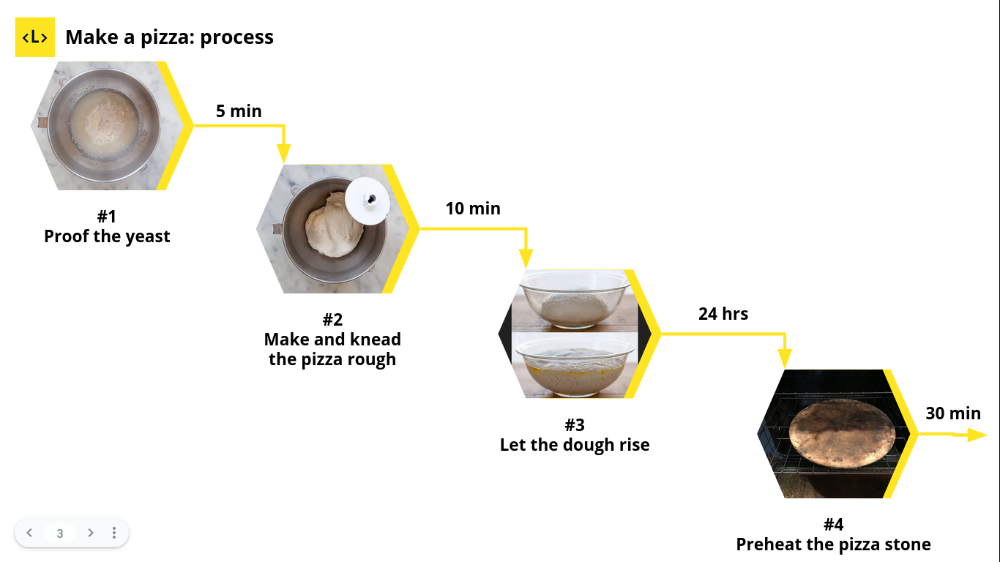
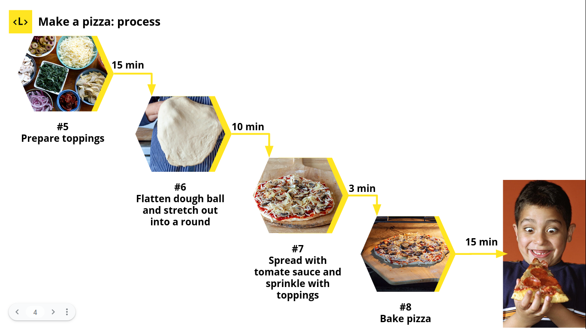

# JavaScript Callbacks & Promises Workshop

El sitio web [Simply Recipes](https://www.simplyrecipes.com/recipes/homemade_pizza/) propone la siguiente receta para preparar una pizza:

Tenemos una función de JavaScript para cada etapa de la receta. En este repositorio se presenta las diferentes alternativas para coordinar la ejecución de cada función y lograr seguir la receta paso a paso:

* Callbacks: [aquí](./callbacks.js) usamos la versión _callback_ de cada función anidando un callback dentro de otro. El resultado es un callback hell.
* Promises: acá usamos la versión de _promesas_ de cada función. El primer resultados son [promesas anidadas](./promises.js) que nos llevan de nuevo a un callback hell. Luego mejoramos nuestra implementación hacia [promesas encadenadas](./promises-reloaded.js). Finalmente, en una [tercera versión](./promises-all.js) hacemos uso de _Promise.all_ para ejecutar los pasos los pasos #4, #5 y #6 de la receta _"al mismo tiempo"_ y esperar la culminación de todos los pasos para continuar con el paso #7.
* Async/Await: [esta](./async-await.js) alternativa usa async/await para producir código con pinta sincrona, más fácil de enteder, pero que sigue siendo asíncrono.

La sesión con las estudiantes está disponible [aquí](https://youtu.be/N7MVHUAdY6U) y la presentación [acá](https://docs.google.com/presentation/d/1pA4_SMlRTsBaJSlAJJDNTfRGAPPvp6fc11VVN4LYOvE/edit?usp=sharing).
